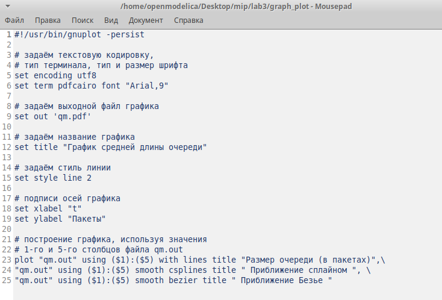
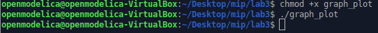
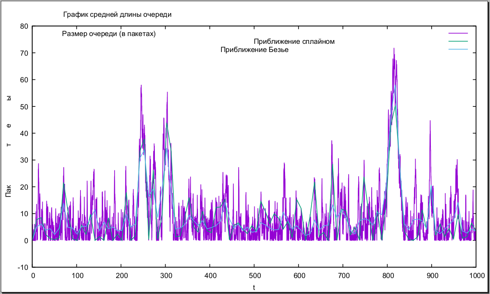

---
## Front matter
lang: ru-RU
title: Лабораторная работа №3
author: |
	 Аминов Зулфикор\inst{1}

institute: |
	\inst{1}Российский Университет Дружбы Народов

date: 30.04, 2022, Москва, Россия

## Formatting
mainfont: PT Serif
romanfont: PT Serif
sansfont: PT Sans
monofont: PT Mono
toc: false
slide_level: 2
theme: metropolis
header-includes: 
 - \metroset{progressbar=frametitle,sectionpage=progressbar,numbering=fraction}
 - '\makeatletter'
 - '\beamer@ignorenonframefalse'
 - '\makeatother'
aspectratio: 43
section-titles: true

---

# Цели

## Цель лабораторной работы

Моделирование стохастических процессов.

# Результат работы

## Теоретическая вероятность потери и средняя длина очереди

{ #fig:1 width=100% height=100% }

# График в GNUplot

## Код скрипта

{ #fig:2 width=100% height=100% }

## Сделали файл исполняемым

{ #fig:3 width=100% height=100% }

## График поведения длины очереди

{ #fig:4 width=100% height=100% }

# Выводы по проделанной работе

## Вывод

Моделировали стохастических процессов.

